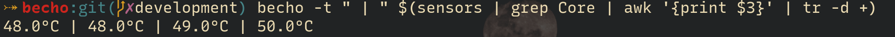
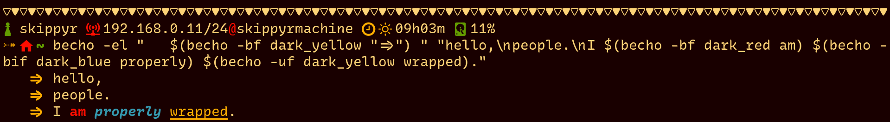
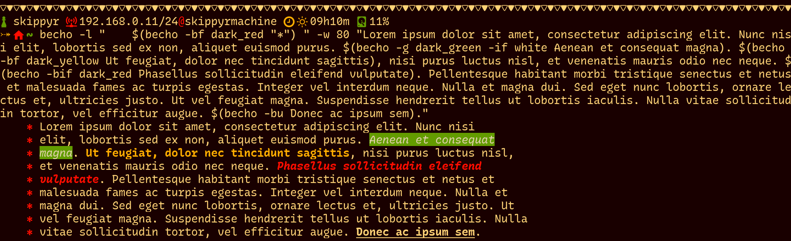

# Becho

`becho` is a terminal utility designed to help you treat, style and print text
to the standard output. It is my rethink of the `echo` command but features of
other commands like `tr`, `fmt` and `fold` can also be found on it.

It should work in both Linux and MacOS.


## Preview

Here you can see screenshots of some real examples using `becho`.








## Installation

### Manual Installation

`becho` is written in Rust, and, for to be used, must be installed from source.
follow these steps:

  + install [`rust`](https://www.rust-lang.org), `git` and `make`.
  + clone this repository using `git`:

    ```bash
    git clone --depth 1 https://github.com/skippyr/becho
    ```

    Use the flag `--depth` with value `1` to specify that you want to download
    only the latest commit.

  + access the repository's directory and use `make` to build and install
    `becho` and its manual in your system.

    ```bash
    make install
    ```

  + if you want to uninstall `becho`, go back to the repository's directory
    and use `make` again, but with a different command:

    ```bash
    make uninstall
    ```
    
### Docker Installation

There is a Docker image in this repository that you can use to test `becho`.


## What features it has?
`becho` can:
  + change the foreground and background color of a text and apply dim colors.
  + place a separator between the arguments received, useful when print elements
    of shell script array.
  + apply bold, italic, underline and crossed out text.
  + change the case of your text to a variety of cases, useful when printing
    titles and names.
  + escape new line (\n), tab (\t) and escape (\e, \x1b and \033) characters.
  + repeat the output.
  + adjust left indentation, that can even contains colored symbol.
  + control width and wrap text properly even with color sequences.


## More Information

Please refer to the manual of `becho` after you install it by using
`becho --help` or `man becho`.

## Copyright

Copyright (c) 2023, Sherman Rofeman. MIT License.
