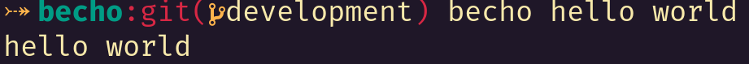
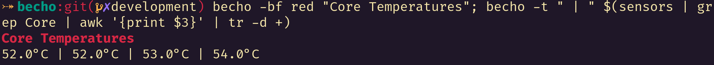

# Becho

`becho` is a terminal utility designed to help you treat, style and print text
into the standart output. It is my rethink of the `echo` command with more
features.


## Preview

Here you can see screenshots of some real examples using `becho`.





## Development

This project still under development. However, some features have already been
implement and can be tested by you.

I plan to continue adding more features, but those will be replaned before being
added.

Expect some changes until the end of this first stage of its development.

## Installation

`becho` is written in Rust, and, for to be used, must be installed from source.
To do it, if you are using MacOS or Linux, follow these steps:

  + install [`rust`](https://www.rust-lang.org), `git` and `make`. If you
    are using a MacOS, the last two dependencies can be installed in the
    `development tools` kit. If you are using Linux, your distribution's package
    manager can have those, but you can the installation manually if not.
  + clone this repository using `git`:

    ```bash
    git clone --depth 1 https://github.com/skippyr/becho
    ```

    Use the flag `--depth` with value `1` to specify that you want to download
    only the latest commit.
  + access the repository's directory and use `make` to build and install
    the `becho` and its manual in your system.

    ```bash
    make install
    ```
  + you can the use `becho --help` or `man becho` to obtain usage instructions.
  + if you want to uninstall `becho`, go back to the repository's directory
    and use `make` again, but with a different command:

    ```bash
    make uninstall
    ```

`make` were configured to install `becho` in MacOS and Linux as they use
pratically the same directory structure. In Windows, you may have to separate
the `becho`'s binary in a separate directory and add that directory to your
`${PATH}` environment variable by using your system's settings manually. You
can avoid this, by using it inside of `WSL` (windows subsystem for linux).

Alternatively, if you know how to use a Docker container, there is instructions
to build an image with `becho` already installed in this repository in the
`dockerfile`.

## What it can do?

`becho` can make treat, style and print text into the standart output, similar
to the `echo` command.

It can accept a text to be handled by concatenating the command line arguments.
It will do its magic with the properties you will define with flags and output
it into the standart output.


### Separator

For example, using the command line arguments:

```bash
becho hello world
```

`becho` will interpret those arguments as the text `hello world`. By default,
`becho` will consider a separator to be used when concatenating the arguments
as one space, but it can be changed by using the flag `-t` or `--separator`, so
the command:

```bash
becho -t " | " hello world
```

Now, will be interpreted as the text `hello | world`. This feature
is really useful to place a separator in between the elements of an array.


### Escapes

By default, `becho` will not interpret escape sequences that are in the
arguments of a command line. If you want, there is the flag `-e` or `--escape`
that will make `becho` escape new line and tab sequences. A tab character will
be replaced by two spaces.


### Colors

`becho` is capable of easily setting colors for the foreground and background
by using the flag `-f` or `--foreground-color` and `-g` or `--background-color`
respectively:

Those flags accept the name of a color from the 4-bits palette or a value
from the 8-bits palette, which is a value from 0 to 255.

For example:

```bash
becho -f red "foo"
```

And:

```bash
becho -f 30 "bar"
```

You can use a dim variant of the color you chose by using the flag `-d` or
`--dim`.

You will only see colors if your terminal can support it. An example of a
good terminal is [`kitty`](https://github.com/kovidgoyal/kitty).

### Cases

`becho` can change the cases of your text to a lot of variants of cases by
using the flag `-c` or `--case`. For example:

```bash
becho -c snake "hello world"
```

### Bold

You can specify that you want the output to use bold text by using the
flag `-b` or `--bold`.

You will only be able to see bold characters if your font support it. An example
of font with great support is the one used in the screenshots.

### Underline

You can specify that you want the output to use underlined text by using the
flag `-u` or `--underline`.

### Italic

You can specify that you want the output to use italic text by using the
flag `-i` or `--italic`.

You will only be able to see italic characters if your font support it. An
example of font with great support is the one used in the screenshots.

### Crossed Out

You can specify that you want the output to use crossed out text by using the
flag `-x` or `--crossed-out`.


## No End Line Break

By default, `becho` will output with a line break in the end
of the text, the flag `-n` or `--no-end-new-line` removes it.

## Repeat

The flag `-R` or `--repeat` can be used to define how many times the
output will be shown. By default its value is 1.


## More Information

The instructions you saw in this document are just examples, if want more
details, please refer to the manual of `becho` after you install it.
