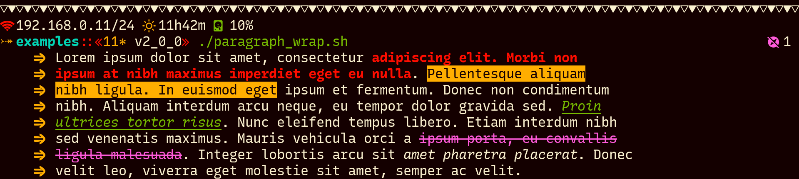

# Becho

`becho` is a terminal utility designed to help you treat, style and print text
to the standard output. As the name implies, `becho` means `better echo`: 
it is my rethink of the `echo` command with new features mixed with features
that you can find in other commands like `tr`, `fmt` and `fold`, but, this
time, done right.

It is the tool that you have been missing for a long time to properly create
beautiful and maintanable shell scripts.

It should work in both Linux and MacOS.


## What features it has?
`becho` can:

  + change the foreground and background color of a text and apply dim colors.
  + place a separator between the arguments.
  + apply bold, italic, underline and crossed out text.
  + change the case of your text to a variety of cases.
  + escape new line (\n), tab (\t) and escape (\e, \x1b and \033) characters.
  + repeat the output a desired number of times.
  + adjust left indentation with colored symbols.
  + wrap text properly even with styles.
  + ignore empty arguments.


## Preview

Here you can see screenshots of some real examples using `becho` in some
scripts.





Those scripts are at `scripts/examples` for you to test after you have
installed `becho`.

## Installation


### Manual Installation

`becho` is written in Rust, and, for to be used, must be installed from source.
follow these steps:

  + install [`rust`](https://www.rust-lang.org), `git` and `make`.
  + clone this repository using `git`:

    ```bash
    git clone --depth 1 https://github.com/skippyr/becho
    ```

    Use the flag `--depth` with value `1` to specify that you want to download
    only the latest commit.

  + access the repository's directory and use `make` to build and install
    `becho` and its manual in your system.

    ```bash
    make install
    ```

  + if you want to uninstall `becho`, go back to the repository's directory
    and use `make` again, but with a different command:

    ```bash
    make uninstall
    ```
   

### Docker Installation

There is a Docker image in this repository that comes with `becho`
pre-installed. You can use it to test it.


## More Information

If you are a user, please refer to the manual of `becho` after you install it by
using `becho --help` or `man becho`.

If you are a developer, you can use `cargo` to compile the internal
documentation and open it in your default browser by using `cargo doc --open`.


## See Also

  + [`Tropical Paradise`](https://github.com/skippyr/tropical_paradise) - A
    beautiful and useful color scheme made for terminal wizards.
  + [`River Dreams`](https://github.com/skippyr/river_dreams) - The ZSH theme
    that developers have been dreaming for a long time.
  + [`Recursive`](https://github.com/arrowtype/recursive) - a perfect coding
    font.


## Issues And Enhancements

If you have found an issue while using this software, you can report it in
the issues tab of its page on GitHub. Enhacements can also be asked in the
same way.


## Copyright

Copyright (c) 2023, Sherman Rofeman. MIT License.
